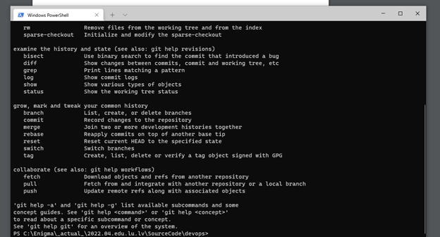
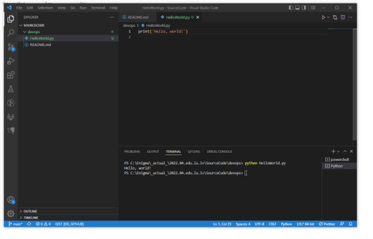
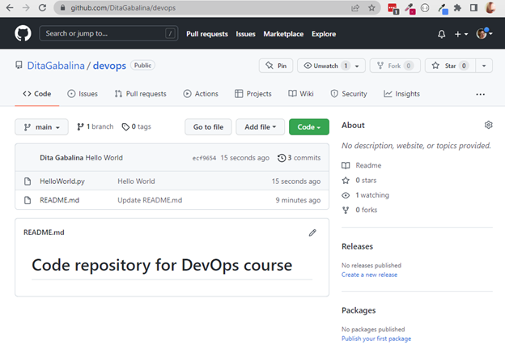

# 1.mājas darbs, D.Gabaliņa

1. GitHub Repozitorijs: https://github.com/DitaGabalina/devops
2. Uzstādīts Git: skat. 1. attēls. Windows Terminal ar izpildītu git comandu
3. Uzstādīts VsCode redaktors: skat. 2. HelloWorld programma python valodā VsCode redaktorā, ar izpildi vscode integrētajā terminālā

<figcaption>1. attēls. Windows Terminal ar izpildītu git comandu</figcaption>

<figcaption>2. HelloWorld programma python valodā VsCode redaktorā, ar izpildi vscode integrētajā terminālā</figcaption>

<figcaption>3. attēls. GitHub repozitorijs ar Readme un Hello World programmām</figcaption>
