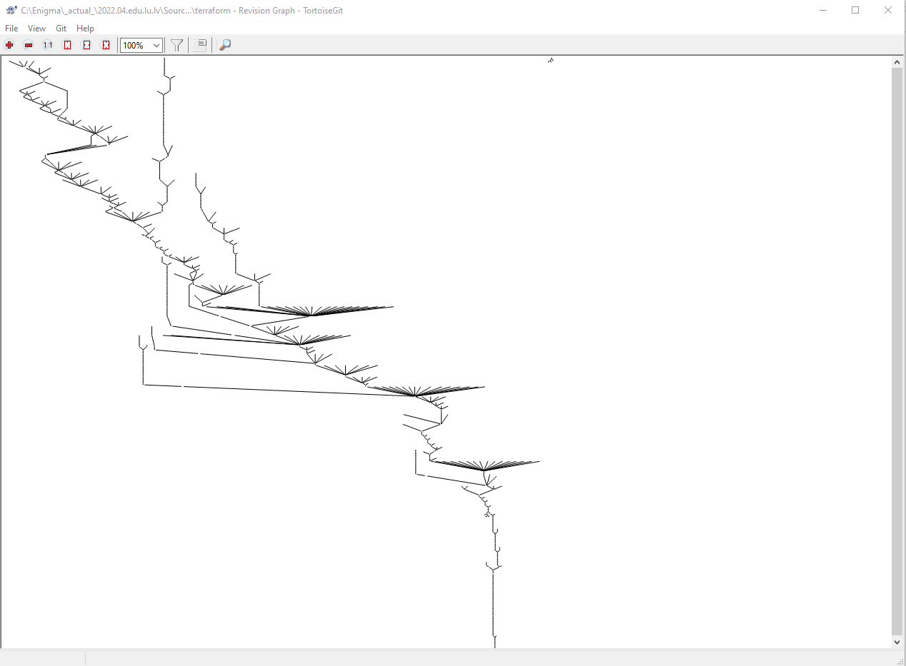

# 2.mājas darbs, D.Gabaliņa

1. Mājas darba GitHub Repozitorijs: [šeit](https://github.com/DitaGabalina/devops_2)
2. 13.punkts - salīdzinot divu identisku datņu, kas atrodas dažādās mapēs, to hash neatšķiras. Skat. 1.attēls un 2. attēls. Ilustrācijai pievienots arī `pwd` un `git` status komandu izvads.
3. 15.punkts - Terraform klonēšanu tomēr veicu atsevišķā mapē terraform kursa pirmkodam atvēlētajā mapē. Skat. 3.attēls.
4. 16.punkts - (a) vēsturi var pārskatīt, izmantojot VsCode un tā paplašinājumu funkcionalitāti. (b) citi rīki, piemēram, TortoiseGit arī ļauj iegūt informāciju par izmaiņu vēsturi. Skat 4.un 5.attēlus. (c) informāciju var iegūt arī ar `git log` komandu no termināla vai git bash komandrindas. Visērtāk ātrai pārskatīšanai var izmantot, ierobežojot attēlojamo ierakstu skaitu `git log --pretty=oneline -10`, vai ierobežojot pēc datuma `git log --since=1.months`.
5. 17.punkts - izmantota komanda `git log --pretty=oneline --author="Laura Pacilio" -20`. Skat.6.attēls.
6. 18.punkts - izmantota komanda `git log --pretty=oneline --author="Laura Pacilio" -20 --since="2021-09-01" --before="2021-09-30"`
7. 18.punkts - izmantota komanda `git log --pretty=oneline --author="Laura Pacilio" -20 --since=1.days`. Skat. 8.attēls. Atrasts ieraksts 3 dienas vecā vēsturē.

## Attēli

<figcaption>1. attēls. Hash summa module_1 mapē ievietotam attēlam</figcaption>

<figcaption>2. attēls. Hash summa module_2 mapē ievietotam attēlam</figcaption>

<figcaption>3. attēls. Terraform klonētās mapes atrašanās vieta</figcaption>

<figcaption>4. attēls. Terraform commit vēsture izmantojot VS Code</figcaption>

<figcaption>5. attēls. Terraform vēsture izmantojot TortoiseGit</figcaption>

<figcaption>6. attēls. git log izmantošana konkrēta autora veikto izmaiņu meklēšanai</figcaption>

<figcaption>7. attēls. git log izmantošana konkrēta autora veikto izmaiņu meklēšanai septembrī</figcaption>

<figcaption>8. attēls. git log izmantošana konkrēta autora pēdējā laikā veikto izmaiņu meklēšanai</figcaption>